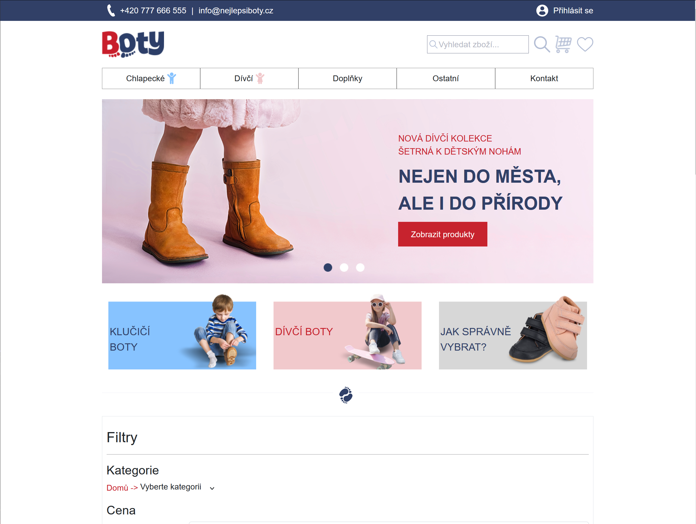
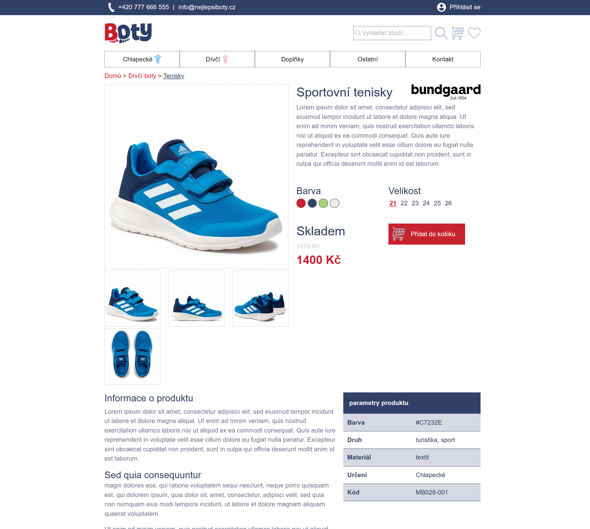
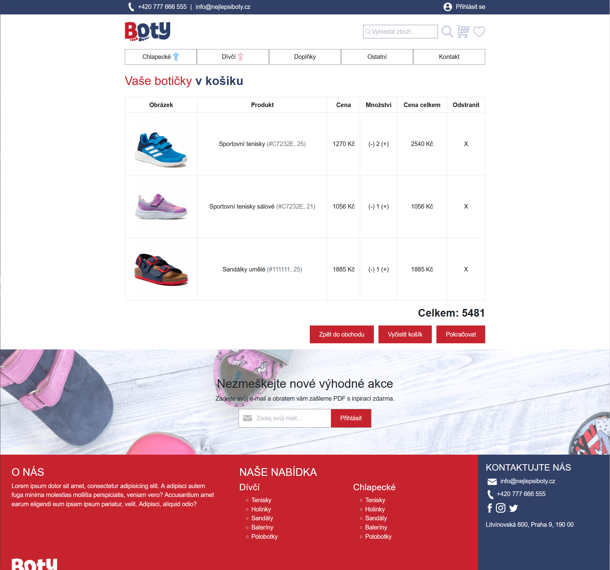
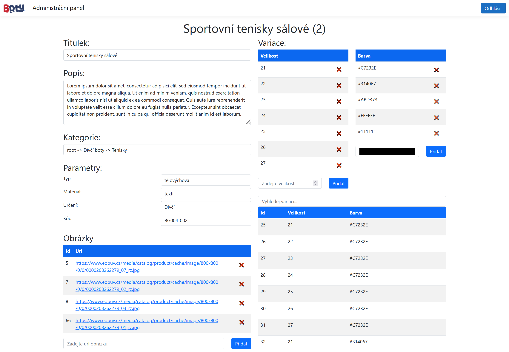
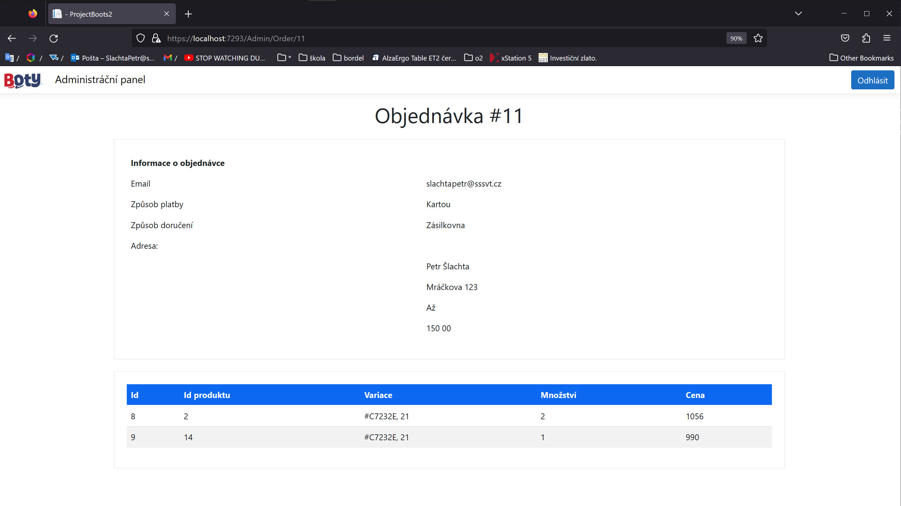

# ProjectBoots2

A simple e-shop made at school to practice ASP.NET and mySQL   

you can view products, add them to cart and place order. As a admin you are able to configure everything and view placed orders.

  
  
  
  

